# Veriscope - Realtime Fact-Checking for Live Debates

Veriscope is a real-time pipeline that:

1. captures live speech from a microphone,
2. transcribes complete phrases continuously,
3. launches one Temporal workflow per phrase,
4. runs fact-check analysis,
5. posts validated results to the app API,
6. broadcasts overlay updates for OBS.

The project is designed for political-debate streams with a configurable video delay (default: 30s).

## What is in this repository

This repo contains 3 connected subsystems:

- `texte/` and `ingestion/`: realtime speech-to-text and JSON emission.
- `workflows/`: Temporal launcher, workflow, worker, activities (analysis + POST).
- `app/`: Laravel API + broadcast overlay page (`/overlays/fact-check`) + OBS scene switching.

## End-to-end data flow

```mermaid
flowchart LR
  Mic["Virtual/Physical Mic"] --> STT["Realtime STT (Mistral)"]
  STT --> JSONL["JSONL transcript lines"]
  JSONL --> Launcher["workflows/debate_jsonl_to_temporal.py"]
  Launcher --> Temporal["Temporal Workflow per line"]
  Temporal --> Activity["analyze_debate_line + correction check"]
  Activity --> Post["POST /api/stream/fact-check"]
  Post --> App["Laravel app-web"]
  App --> Reverb["Broadcast stream.fact-check"]
  Reverb --> Overlay["/overlays/fact-check in OBS Browser Source"]
```



## Current behavior (important)

- The fusion launcher is now **Mistral-only** for stability.
- ElevenLabs scripts still exist, but `run_fusion_to_temporal.sh` forces `--providers mistral`.
- One workflow is started per transcript line.
- Delay is computed from the estimated phrase start (`metadata.timestamp_start`) to align display with delayed video.

## Directory map

- `README.md`: this file (global runbook).
- `docker-compose.yml`: full stack (Temporal + app + worker + reverb + queue + mediamtx).
- `scripts/run_stack.sh`: stack helper (`up/down/restart/ps/logs`).
- `cle.env.example`: env template for workflows.
- `texte/realtime_transcript_fusion.py`: realtime STT JSON emitter (Mistral stream).
- `texte/run_fusion_to_temporal.sh`: one-command STT -> Temporal launcher.
- `workflows/debate_jsonl_to_temporal.py`: reads JSONL, computes delay, starts workflows.
- `workflows/debate_workflow.py`: Temporal workflow orchestration.
- `workflows/activities.py`: fact-check analysis + POST to app API.
- `app/routes/api.php`: `POST /api/stream/fact-check`.
- `app/routes/web.php`: overlay page route.

## Prerequisites

- Docker Desktop (with `docker compose`).
- Python 3.11+ (local venv for transcription scripts).
- A working input microphone (physical or virtual).
- API key in `cle.env`.

## 1) Initial setup

### 1.1 Clone and install Python dependencies

```bash
cd /path/to/workspace
git clone https://github.com/Barbapapazes/hackathon-paris.git
cd hackathon-paris

cd ingestion
python3 -m venv .venv
source .venv/bin/activate
pip install -r requirements.txt
pip install -r ../texte/requirements.txt
cd ..
```

### 1.2 Configure environment

```bash
cp cle.env.example cle.env
```

Fill at least:

```bash
MISTRAL_API_KEY=...
FACT_CHECK_POST_URL=http://app-web:8000/api/stream/fact-check
VIDEO_STREAM_DELAY_SECONDS=30
FACT_CHECK_ANALYSIS_TIMEOUT_SECONDS=30
```

Notes:

- `FACT_CHECK_POST_URL` should target `app-web` inside Docker network.
- `cle.env` is auto-loaded by worker and transcript scripts.

## 2) Start the full stack

### Option A (recommended)

```bash
./scripts/run_stack.sh up --build
```

### Option B (raw compose)

```bash
docker compose up -d --build
```

### Health checks

```bash
docker compose ps
./scripts/run_stack.sh logs workflows-worker
```

Expected services:

- `temporal` on `7233`
- `temporal-ui` on `8080`
- `app-web` on `8000`
- `app-reverb` on `8081`
- `app-queue`
- `workflows-worker`

## 3) Find microphone index

```bash
source ingestion/.venv/bin/activate
python texte/realtime_transcript_fusion.py --list-devices
```

Example output:

- `index: 1, name: WOODBRASS UM3`
- `index: 2, name: Microphone MacBook Air`

Use `--input-device-index` with the selected index.

## 4) Run realtime transcription -> Temporal -> fact-check

```bash
cd /Users/godefroy.meynard/Documents/test_datagouv_mcp/hackaton_audio/hackathon-paris
source ingestion/.venv/bin/activate

VIDEO_DELAY_SECONDS=30 MAX_WAIT_NEXT_PHRASE_SECONDS=0.5 ANALYSIS_TIMEOUT_SECONDS=20 \
./texte/run_fusion_to_temporal.sh \
  --input-device-index 1 \
  --personne "Valérie Pécresse" \
  --source-video "TF1 20h" \
  --question-posee "" \
  --show-decisions
```

What this does:

- emits transcript JSON lines,
- starts Temporal workflows continuously,
- waits dynamic delay to match video stream,
- posts postable fact-check payloads to `/api/stream/fact-check`.

## 5) Validate in Temporal UI

Open: `http://localhost:8080`

For each workflow:

1. open workflow execution,
2. inspect `WorkflowExecutionCompleted` result,
3. check:
   - `analysis_result.afficher_bandeau`
   - `post_result.posted`
   - `post_result.status_code`
   - `timing_debug.measured_delay_from_start_seconds`
   - `timing_debug.delay_error_seconds`

Interpretation:

- `afficher_bandeau=false` => workflow intentionally skipped posting.
- `analysis_not_postable` => no valid overlay payload built.
- `posted=true` + `200` => API accepted and broadcast path should trigger.

## 6) Validate overlay/API side

### 6.1 API endpoint

- Endpoint: `POST http://localhost:8000/api/stream/fact-check`
- Route file: `app/routes/api.php`

### 6.2 Overlay page for OBS

- Overlay URL: `http://localhost:8000/overlays/fact-check`
- Route file: `app/routes/web.php`

### 6.3 Useful logs

```bash
docker compose logs -f app-web app-queue app-reverb workflows-worker
```

Look for:

- `app-web`: `/api/stream/fact-check` hits,
- `app-queue`: `VerifyFactCheckSceneTimestampJob` running,
- `workflows-worker`: analysis activity and post results.

## Transcript JSON contract

Each emitted line follows:

```json
{
  "personne": "Valérie Pécresse",
  "question_posee": "",
  "affirmation": "Last N committed phrases",
  "affirmation_courante": "Current complete phrase",
  "metadata": {
    "source_video": "TF1 20h",
    "timestamp_elapsed": "00:24",
    "timestamp_start": "2026-03-01T13:37:11.031Z",
    "timestamp_end": "2026-03-01T13:37:15.599Z",
    "timestamp": "2026-03-01T13:37:15.599Z"
  }
}
```

`timestamp_start` is used for delay alignment.

## Workflow input contract

Each Temporal run receives:

- `current_json`: current transcript line.
- `last_minute_json`: aggregate context for last 60s.
- `post_delay_seconds`: computed remaining delay before post.
- `analysis_timeout_seconds`.
- `next_json`: next phrase payload when available.

## Runtime knobs

You can tune behavior at launch time:

- `VIDEO_DELAY_SECONDS` (default 30)
- `MAX_WAIT_NEXT_PHRASE_SECONDS` (default 1.0)
- `ANALYSIS_TIMEOUT_SECONDS` (default 30)

And in `cle.env`:

- `VIDEO_STREAM_DELAY_SECONDS`
- `FACT_CHECK_ANALYSIS_TIMEOUT_SECONDS`
- `MISTRAL_WEB_SEARCH_MODEL`
- `SOURCE_SELECTION_MODE`
- rate-limit backoff settings.

## Troubleshooting

### 1) `ModuleNotFoundError: mistralai`

You are not in the venv or dependencies are missing.

```bash
cd ingestion
python3 -m venv .venv
source .venv/bin/activate
pip install -r requirements.txt
pip install -r ../texte/requirements.txt
```

### 2) `zsh: command not found: temporal`

Use Docker stack (`scripts/run_stack.sh`) instead of local Temporal binary.

### 3) Worker restart loop: `Namespace default is not found`

Ensure `temporal-create-namespace` completed successfully. Restart full stack:

```bash
./scripts/run_stack.sh restart --build
```

### 4) `OSError: [Errno 48] Address already in use`

Port is already used (often 8000). Stop conflicting process or use another port.

### 5) Mistral realtime crash (`EngineDeadError`)

The transcript script now includes auto-reconnect logic. If persistent, relaunch script and check API key/network.

### 6) No overlay in OBS

Check order:

1. workflow actually posts (`post_result.posted=true`),
2. app receives `/api/stream/fact-check`,
3. OBS Browser Source points to `http://localhost:8000/overlays/fact-check`,
4. OBS websocket scene names match app config.

### 7) Why no POST even when transcription works

Because workflow can intentionally skip when:

- `afficher_bandeau=false`,
- missing sources,
- next phrase detected as self-correction.

## Development workflow

```bash
git checkout -b codex/<feature>
# edit
python3 -m py_compile workflows/*.py texte/*.py
bash -n texte/*.sh scripts/*.sh
git add <files>
git commit -m "feat: ..."
git push origin codex/<feature>
```

## Additional docs

- `workflows/README.md`: Temporal-specific details.
- `texte/README.md`: STT scripts and options.
- `app/README.md`: API payload examples.

